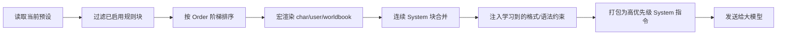

# 📘 教程：用酒馆预设驱动 AI 创作世界书

> 《世界书工坊》内置了对 SillyTavern（酒馆）预设的**深层兼容**。通过导入并挂载你的专属预设，你可以让 AI 在严格遵守你自定义规则（W++ 语法、Token 限制、极简文风、否定词过滤……）的前提下，为你**量身定制**世界书条目——从此告别"AI 写得不像你"的尴尬。

---

## 📑 本教程你将学会

- [✅ 什么是"酒馆预设"，为什么它能救你的设定](#-什么是酒馆预设)
- [🛠️ 第一步：导入并管理你的酒馆预设](#️-第一步导入并管理你的酒馆预设)
- [💬 第二步：在设定交流助手中开启预设挂载](#-第二步在设定交流助手中开启预设挂载)
- [✍️ 第三步：发送指令，让 AI 自动手搓设定](#️-第三步发送指令让-ai-自动手搓设定)
- [🧠 后台工作原理：预设如何被"静默编译"进请求](#-后台工作原理预设如何被静默编译进请求)
- [🚀 进阶玩法：让预设威力翻倍](#-进阶玩法让预设威力翻倍)
- [❓ 常见问题 FAQ](#-常见问题-faq)

---

## ✅ 什么是"酒馆预设"

酒馆（SillyTavern）的**预设**（Prompt Manager / Context Template）本质上是一组"规则块（Blocks）"的集合。每个规则块都是一个独立的小指令，比如：

| 规则块示例 | 作用 |
| --- | --- |
| *Main Prompt* | 定义 AI 的基础身份与任务 |
| *Formatting Lock* | 锁定输出排版，禁止废话 |
| *W++ Style Guide* | 强制使用 W++ 伪代码格式 |
| *Negative Filter* | 过滤掉你不想要的词汇/风格 |

在工坊中，这些规则块会被**分解、勾选、按顺序编译**，并在每次 AI 请求时作为**高优先级 System 指令**注入——相当于给 AI 戴上了一个"专属行为模板"。

---

## 🛠️ 第一步：导入并管理你的酒馆预设

### 1️⃣ 打开预设管理面板

点击工坊顶部工具栏的 **「⚙️ 提示词管理」** 按钮（位于预设下拉菜单旁），进入预设管理界面。

### 2️⃣ 导入预设文件

1. 在管理面板中找到 **「📥 导入酒馆预设」** 按钮并点击。
2. 选择你在酒馆中使用的预设 JSON 文件（`.json` 格式）。
3. 工坊的**万能导入引擎**会自动识别并拆解：
   - **现代 Prompt Manager**：`prompts` / `blocks` 数组结构；
   - **经典 Context Template**：`system_prompt` / `story_string` / `jailbreak` 等扁平字段。
   - 即便字段名略有出入（`identifier`、`label`、`state` 等），也会自动降级映射，**几乎不会导入失败**。

### 3️⃣ 检查与勾选规则块

导入成功后，你会在块编辑器中看到一个个拆分好的规则块（如 *Main Prompt*、*Formatting Lock*、*W++ Style Guide* 等）。每个块都带有一个 **「启用」复选框**：

- ☑️ **勾选** = 该规则会在 AI 创作时被注入；
- ⬜ **取消勾选** = 该规则暂不启用（比如先关掉一条你不想要的风格指令）。

> 💡 **小技巧**：你还可以用 **↕️ 上移/下移**调整规则块的执行顺序，用 **✏️ 编辑**微调内容，或直接 **🗑️ 删除**某条规则。改完记得点 **「💾 保存修改」**。

---

## 💬 第二步：在设定交流助手中开启预设挂载

1. 在工坊界面打开 **「🤖 设定交流助手」** 聊天面板（点击导航栏 💬 按钮）。
2. 在聊天面板的设置区中找到开关 **「📦 注入提示词预设」**（描述为"注入当前预设已启用的 System 区块"）。
3. **点击开启该开关**。开启后，聊天时 AI 便会自动携带你预设中所有"已启用"的 System 规则块。

> 🎯 想要更自由？旁边还有一个 **「🛠️ 读写模式」** 开关：开启后，AI 助手还可以静默地直接修改工作台数据（比如按对话指令增删条目、调整参数），实现"对话式遥控工坊"。

---

## ✍️ 第三步：发送指令，让 AI 自动手搓设定

开关打开后，就像平时和 AI 聊天一样直接发送创作指令即可，例如：

> *"帮我设计一个蒸汽朋克风格的『炼金兵工厂』条目，包含名称、触发关键词和正文设定。"*

> *"根据当前世界观，补全『暗影议会』的组织结构和核心人物，注意别超出预设的文风限制。"*

AI 会**在预设规则的约束下**完成创作——你写死的 W++ 格式、Token 上限、极简风格、否定词过滤等，统统都会被遵守。

---

## 🧠 后台工作原理：预设如何被"静默编译"进请求

当「注入提示词预设」开关开启后，工坊引擎会在**每次发送网络请求之前**，自动执行以下三步（全程无需你干预）：

1. **读取当前预设**：定位你在「预设/提示词管理」中选中的那套预设；
2. **过滤 + 排序**：只取"已启用"的规则块，并按 `order` 字段从低到高排列（保证核心设定靠前、Token 截断时优先保留）；
3. **智能清洗**：自动渲染酒馆宏（`{{char}}`、`{{user}}`、`{{worldbook}}` 等）、合并连续 System 块、并把检测到的**格式与语法特征**（W++ / XML / 引号星号排版）作为额外约束注入。

最终，这些规则会作为**高优先级的 System 消息**与你的创作指令一同发给大模型，确保输出"长在预设上"。

---

## 🚀 进阶玩法：让预设威力翻倍

### 🎓 联动"自定义格式克隆引擎"
在导航栏点击 **🎓 格式学习**，粘贴一段你喜欢的排版样本（如 `[Character("青子")]{...}`）。工坊会提取语法特征，并在之后的生成中 100% 复刻——与酒馆预设搭配，等于"预设管内容、格式引擎管排版"。

### 🧠 联动"全局知识数据库"
在导航栏点击 **🗄️ 数据库**，导入一整本《科技树》或《魔法大全》作为底层资料并勾选启用。AI 在遵守预设规则的同时，还会**强制参考**这些底层逻辑，彻底杜绝设定崩坏。

### 🎯 结合批量生成 / 智能调优
开启预设后使用 **✨ 批量生成** 或 **🧠 智能调优**，AI 会带着你的专属规则批量产出/统一优化条目——适合一次性把整个世界观"规范化"。

### ⚙️ 采样参数微调
在「⚙️ API 配置」中可微调温度、频率惩罚、Top P 等参数。与预设结合，能进一步控制 AI 的"发挥空间"——想稳定就调低温度，想有惊喜就调高。

---

## ❓ 常见问题 FAQ

**Q：导入预设时提示"未能识别有效结构"怎么办？**
A：请确认文件是合法的 JSON，且包含 `blocks`/`prompts` 数组，或 `system_prompt`/`story_string` 等字段。旧版或加密的自定义格式可能无法解析，可先手动提取成标准 JSON 再导入。

**Q：开关开启了，为什么 AI 好像没遵守规则？**
A：请检查该预设中**是否有已勾选的规则块**（全都没勾选则等于空预设）。另外部分模型对超长指令的遵循度有限，可适当精简规则块数量。

**Q：预设会影响"设定交流助手"以外的功能吗？**
A：会的。批量生成、智能调优、审查等功能在组装请求时同样会读取当前预设的已启用规则块，因此预设是"全局生效"的——想只影响聊天，可在创作前临时取消勾选部分规则块。

**Q：切换预设会怎样？**
A：切换预设时工坊会清空当前对话记忆并重新注入新预设，避免"精神分裂"。旧的对话记录仍保留在历史中。

---

## 🎉 现在就去试试吧！

打开工坊 → 导入你的酒馆预设 → 开启「📦 注入提示词预设」→ 发一条创作指令。你会发现，AI 的产出**从"它自己"变成了"你的它"**。

> 遇到问题？欢迎在仓库 **Issue** 中提出，或在「设定交流助手」里直接问 AI 助手！
